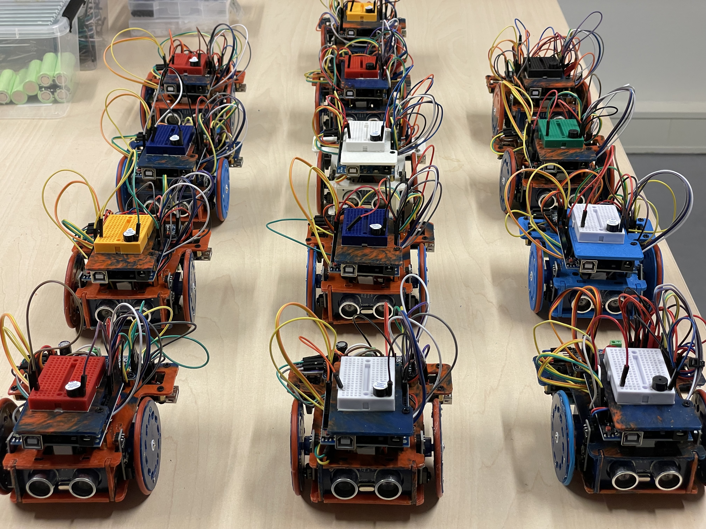

# RefiBot

> A small educational robot made from recycled plastic from fishnets

RefiBot is an open-source educational robot designed to be built at home using recycled plastics from fishnets, promoting sustainability and encouraging learning. 
The project includes hardware designs, software libraries, and documentation to help you build and program your RefiBot.




## Table of Contents

- [Features](#features)
- [Hardware](#hardware)
- [Software](#software)
- [Demo Video](#demo-video)
- [License](#license)

## Features

### Key Features

- Modular and customizable structure: RefiBot's laser-cut components are designed to fit together easily, making assembly and customization a breeze.
- Support for various sensors and actuators: RefiBot can be equipped with a wide range of sensors and actuators, such as distance sensors, light sensors, and servo motors, to adapt to different tasks.
- Pre-programmed example code: The provided `example.ino` Arduino sketch is the perfect start point to explore the functions of RefiBot.
- Open-source software and hardware: RefiBot's design files, software libraries, and example code are all open-source, encouraging collaboration and modification to suit your needs.

### Possible Applications

RefiBot's flexibility makes it an ideal platform for a variety of applications, including:

- Robotics education: Teach programming and robotics concepts using RefiBot as a hands-on learning tool.
- Research and development: Use RefiBot as a test platform for new algorithms, sensors, or actuators.
- Artistic installations: RefiBot's unique appearance and movement capabilities can be used in interactive installations or performances.

The possibilities for RefiBot are only limited by your imagination and creativity. We encourage you to explore its potential and share your own customizations and applications with the community.


## Hardware

The RefiBot is a robotic platform built using various hardware components, including motors, sensors, and controllers.

### Main Components

- Arduino Uno
- Servo motors
- TCS34725 color sensor
- PCA9685 PWM servo driver
- QTR reflectance sensor array for line following
- HC-SR04 ultrasonic sensor
- Buzzer for audio feedback
- Power supply (LiPo battery, or USB)
- Several laser-cut parts

### Laser-cut parts

The robot consists of the following parts, whose design files are available in the `hardware` folder:

1. Ball Holder (`Ball_Holder.png`)
2. Bottom Plate (`Bottom_Plate.png`)
3. Front Plate (`Front_Plate.png`)
4. IR Focus - Dark (`IR_Focus_Dark.png`)
5. IR Focus - Light (`IR_Focus_Light.png`)
6. Left Wheel Disk (`Left_Wheel_Disk.png`)
7. M3 Spacer (`M3_Spacer.png`)
8. Protective Plate (`Protective_Plate.png`)
9. Right Wheel Disk (`Right_Wheel_Disk.png`)
10. Robot Stand (`Robot_Stand.png`)
11. Side Plate (`Side_Plate.png`)
12. Top Plate (`Top_Plate.png`)


## Software

The library `software/awesome_lib.h` provides a set of functions and definitions for controlling the sensors of the RefiBot. 

### Features

- TCS34725 color sensor support
- PCA9685 PWM servo driver support
- QTR reflectance sensor array support for line following
- HC-SR04 ultrasonic sensor support
- Buzzer support for audio feedback
- Wheel odometry with proximity sensors
- Motor control functions for movement (forward, backward, left, right)
- Sonar distance measurement
- Color reading with RGB values

### Dependencies

- Arduino.h
- Wire.h
- Adafruit_TCS34725.h
- Adafruit_PWMServoDriver.h
- QTRSensors.h
- Adafruit_NeoPixel.h

### Example

Please refer to the `example.ino` file in the `software` folder for a sample usage of the library in an Arduino sketch.

The example provided initializes the sensors using the `default_config_setup()` function and prints "Hello World" on the serial monitor:

```cpp
#include "awesome_lib.h"  //Include the awesome library

void setup(){
  default_config_setup();  // Initialize all the sensors
}

void loop(){
  Serial.println("Hello World");  // Print "Hello World" on the serial monitor
}
```

## Demo Video

[Watch the demo video!](./docs/demo.mp4)

## License

This project (hardware and software) is licensed under the GPL3 license - see the [LICENSE](LICENSE) file for details.
