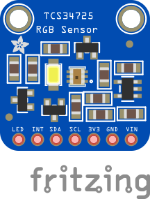

# ReFiBot Overiew and Examples
ReFiBot stands for Recycled Fishnet Robot, as the frame of the robot is made from recycled fishnets. This document goes through some of the features of the robot, and how to program it to perform certain functions. We recommend going through the examples below as a starting point, but please explore all the functions we have madwe available, or even better: program your own and join the ReFiBot community!


## Overview

### Safety Measures

**Do not remove the battery:** 

ReFiBot runs on Li-Ion batteries, these batteries have a lot of power in a small package and have enabled a lot of great technologies, such as electric cars.  However, they must be handled with care, otherwise, they can be quite dangerous. Have in mind that these are not like the typical AA Alkaline batteries, but high-powered 18650 Li-Ion batteries and this is why we you should take extra care in handling and ensuring the + and - are located correctly.


### Turning on the robot

In order to start the robot please turn on the power switch which is located on the rear-left side of the robot. Then, a red LED will flash meaning that the battery provides the necessary power to electronics. 

You will notice that the robot can also turn on when it is connected to a PC via a USB cable. The USB connection can provide a limited amount of power, therefore it is strongly recommended to turn on the power switch first before you connect the robot to a PC. 

### Upload software on the robot

In order to give life to the robot,  instructions in the form of a program should be uploaded to its memory. In order to do that:

1. Execute the Arduino IDE.
2. Connect the ReFiBot to your PC using the provided USB cable.
3. Copy the programs we have prepared for you into the Arduino IDE code editor. 
4. Verify that the right port is selected.
5. Click the upload button.

### Available functions

| Sensors              | Functions                          | Explanation                                           |
|----------------------|------------------------------------|-------------------------------------------------------|
| Time management      | `void wait(float n secs)`          | Wait `n` seconds                                      |
|                      | `void wait for serial input()`     | Wait until the serial monitor receives something       |
| QTR-8 IR line tracker | `uint16 t read_line_black_position()` | Return the position of the black line under the RefiBot |
|                      | `bool* black_line_array()`         | Read the sensor values                                |
|                      | `int array_count(bool* arr)`       | Return the number of sensors that see black under the robot |
| TCS34725 RGB sensor  | `float* read_rgb_sensor()`    | Return three values with the color of the point in front of the camera, coded as `[R,G,B]` |
| HC-SR04 Ultrasonic sensor  | `float get_sonar_distance()` | Return the distance (cm) from the sensor to the object in front of it |
| Buzzer      | `void buzzer_sound(float time)`    | Make a 100Hz sound for `time` seconds                  |
|                      | `void buzzer_number(int n beeps)`  | Beep `n` times                                        |
| Motors      | `void stop_robot()`                 | Stop both motors                                      |
|                      | `void go_front()`                   | Move both motors at the same speed                     |
|                      | `void go_back()`                    | Move both motors backward at the same speed            |
|                      | `void go_right()`                   | Move the left motor forward faster than the right motor |
|                      | `void go_left()`                    | Move the right motor forward faster than the left motor |


## Some examples
### Wheel calibration and setup

The automatic adjustment might not work too well, such as left and right not moving at the same speed, or stop_robot not stopping the robot. If this is the case, you need to change the wheel_stable points to values between 330 and 350. Do this until they stop when only running stop_robot(). Copy-paste the code below to your sketch, and add the direction and setMotorsStablePoints(x,x)  in your setup() for the rest of the tutorial.

```cpp
#include "awesome_lib.h"

void setup(){
  
  left_wheel_front_dir = 1;  // If left wheel goes the wrong direction, change the value 1 to -1
  right_wheel_front_dir = 1; // If right wheel goes the wrong direction, change the value 1 to -1
  
  // First parameter is for left wheel (range between 330-350)
  // Second parameter is for right wheel (range between 330-350)
  setMotorsStablePoints(340, 340);

  default_config_setup();  // Initialize all the sensors (Do not alter this line)!
}
void loop(){
  stop_robot();  // Stop Robot (Check if both wheels stop)
	wait(1.0);     // Wait for 1 second
}
```

### The ultrasonic sensor


HC-SR04 ultrasonic sensor

This sensor measures the time it takes the sound to bounce off of objects. The sensor sends an ultrasonic pulse burst (outside of our hearing spectrum) which travels through the air, hits an object, and then bounces back to the sensor. This is also how bats and dolphins use echolocation. Then, the distance is calculated using the following formula:

$$
Distance = SoundSpeed * Time/2
$$

Fortunately, the provided code calculates automatically the distance for you.


Working principle of the ultrasonic sensor

An easy interface to the sonar is the ***get_sonar_distance()*** function, in which all of the above is already executed.

```cpp
#include "awesome_lib.h"

void setup(){

  default_config_setup();  // Initialize all the sensors (Do not alter this line)!
}

void loop(){
	float distance = get_sonar_distance();  // Read distance (cm)
	Serial.print("Measured distance: ");    // Print results
	Serial.print(distance);
	Serial.println(" cm");
  wait(0.2);                              // Wait for 0.2 seconds 
}
```


### Ultrasonic Wall Detection and Counting

More complex behaviours can always be programmed by combining the different functions. For example we can count the number of walls it has detected. Starting with when a distance larger than 20cm is detected, the robot moves forward until the next sensor reading. But if the distance is equal or less than 20cm, it stops, beeps (for the number of walll counts), moves backward, and rotates right. After this, it loops back to the decision process to re-evaluate the distance.

```cpp 
#include "awesome_lib.h"

static int WALL_COUNT = 0;

void setup(){
  
  left_wheel_front_dir = 1;  // If left wheel go backward, change the value 1 to -1
  right_wheel_front_dir = 1;  // If right wheel go backward, change the value 1 to -1
  
  // First parameter is for left wheel (range between 330-350)
  // Second parameter is for right wheel (range between 330-350)
  setMotorsStablePoints(340, 340);
	default_config_setup();  // Initialize all the sensors (Do not alter this line)!
}

void  loop(){
	float dist = get_sonar_distance(); // Read the distance
	Serial.print("distance: ");        // Print the result
	Serial.print(dist);
	Serial.println(" cm");

// check the distance, if it is lower than 20, execute the commands below
	if (dist < 20.0){

		stop_robot();       // Stop the robot
        WALL_COUNT+=1;      // Increase wall count numvber
        buzzer_nummber(WALL_COUNT);  // Beep for total wall count
		wait(0.2);          // Wait for 0.3 seconds
		go_back();          // Go back 
		wait(0.2);          // and wait 0.2 seconds
		go_right();         // turn right
		wait(0.2);          // wait 0.2 seconds
	}
// else move forwards
	else{
		go_front();         // go straight
		wait(0.2);          // wait 0.2 seconds
	}
}
```

The code above is the implementation of this flowchart in the Arduino language. Please note that the delay statements are there to make the robot has time to move a little. This is somewhat similar to how a vacuum robot behaves, without a mapping algorithm, however.


### RGB colour detection sensor



The TCS34725 board works like a tiny, one-pixel camera that is capable to sense and quantify the colour values of the reflected light when an object is placed in front of it. As you can see on the bottom of the ReFiBot, this sensor is also equipped with a white LED to ensure sufficient light intensity for taking good measurements. 

In order to use this sensor, you can use the ***read_rgb_sensor()*** function, which interfaces with the sensor and returns the intensity of the red, green and blue channels as a value between 0 and 255. 

```cpp
#include "awesome_lib.h"

void setup(){
	default_config_setup(); // Initialize all the sensors (Do not alter this line)!
}

void loop(){

	float* colours = read_rgb_sensor();  // Read the sensor  

	Serial.print("The sensed RGB: ");    // Print the results
	float R = colours[0];
  float G = colours[1];
  float B = colours[2];
  Serial.print("R: ");
  Serial.print(R);
  Serial.print(" ");
  Serial.print(" G: ");
  Serial.print(G);
  Serial.print(" ");
  Serial.print(" B: ");
  Serial.print(B);
  Serial.println(" ");
}
```